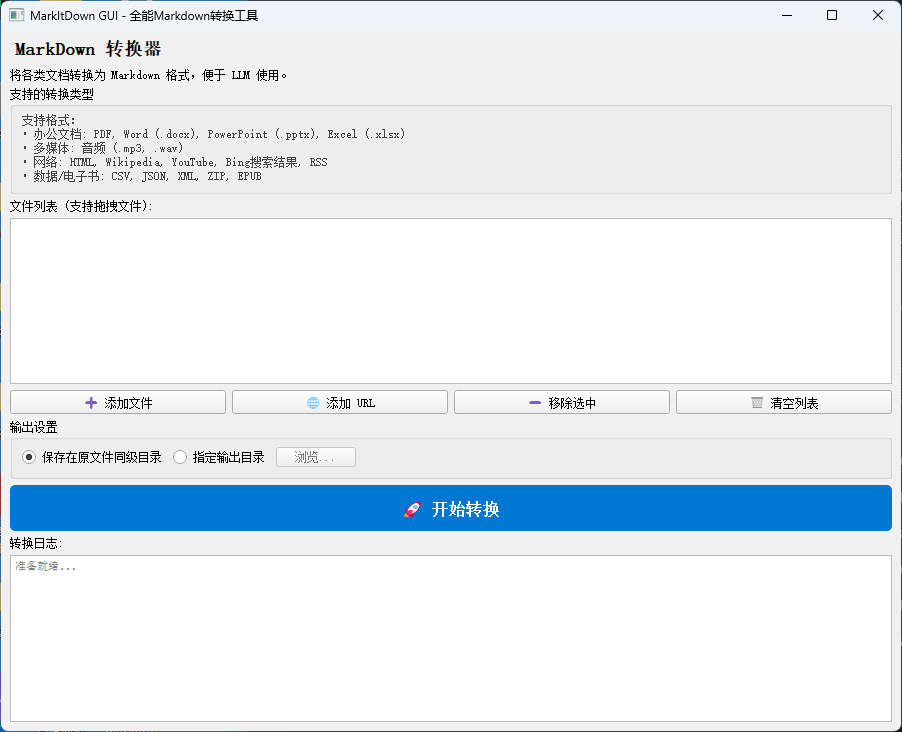

# PyQt MarkItDown GUI

**一个功能强大的本地 MarkItDown 图形界面工具，一键将各种文件转换为 Markdown。**

这个项目为微软的 [MarkItDown](https://github.com/microsoft/markitdown) 库提供了一个现代化的 PyQt5 图形界面 (GUI)。它让非技术用户也能轻松使用 MarkItDown 的强大功能，支持拖拽操作、批量处理以及多种格式的文档转换。



## ✨ 主要特性

*   **🖱️ 简单易用**：直观的图形界面，支持文件的**拖拽添加**。
*   **📂 批量转换**：一次性处理多个文件，自动排队转换，无需逐个操作。
*   **🌐 增强的网页支持**：支持转换百度、知乎、微信公众号等反爬虫网站内容，以及 Wikipedia、RSS 等。
*   **🎵 音频转录**：支持 `.mp3`, `.wav` 等音频文件的元数据提取及语音转文字。
*   **🛡️ 本地隐私**：所有转换逻辑均在本地运行 (基于 MarkItDown)，保护您的数据隐私。
*   **⚙️ 灵活输出**：支持保存在原目录或指定统一的输出文件夹。

## 📝 支持格式

该工具支持将以下格式转换为高质量的 Markdown：

*   **办公文档**:
    *   PDF (`.pdf`)
    *   Word (`.docx`)
    *   PowerPoint (`.pptx`)
    *   Excel (`.xlsx`)
*   **多媒体**:
    *   音频 (`.mp3`, `.wav`) 
*   **网络资源**:
    *   任意网页 URL (HTML)
    *   Wikipedia 页面
    *   YouTube 视频字幕
    *   Bing 搜索结果
    *   RSS 订阅源
*   **数据与电子书**:
    *   电子书 (`.epub`)
    *   数据文件 (`.csv`, `.json`, `.xml`)
    *   压缩包 (`.zip`)

## 🚀 快速开始

### 1. 环境要求
*   Windows / macOS / Linux
*   Python 3.10+
*   建议使用 Conda 环境

### 2. 安装步骤

```bash
# 1. 克隆或下载本项目到本地

# 2. 创建并激活 Conda 环境 (推荐)
conda create -n markitdown-gui python=3.10
conda activate markitdown-gui

# 3. 安装依赖
pip install -r requirements.txt
```

### 3. 运行程序

在项目根目录下运行：

```bash
python gui_app.py
```

## 🛠️ 常见问题

*   **音频转换失败？**
    *   程序内置了 `imageio-ffmpeg`，通常无需额外配置。如果遇到问题，请确保系统安装了 ffmpeg 并添加到了环境变量。
*   **网页转换为空？**
    *   程序已自动处理 User-Agent，但部分网页可能需要登录或有极强的反爬措施，这属于正常现象。

## 📄 许可证

本项目遵循 MIT 许可证。核心转换能力由 [MarkItDown](https://github.com/microsoft/markitdown) 提供。
